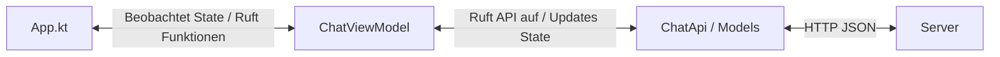
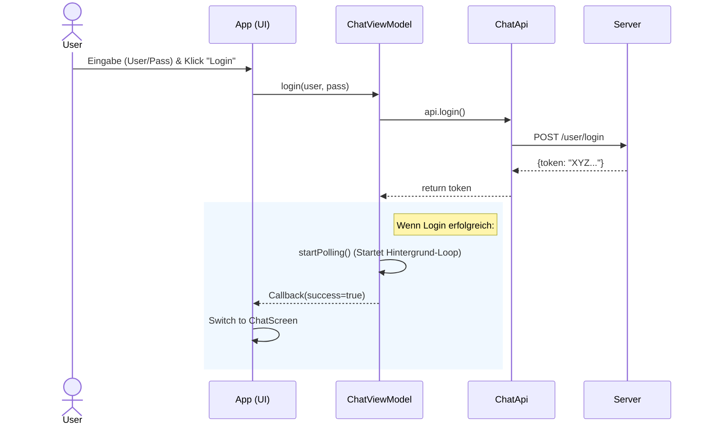
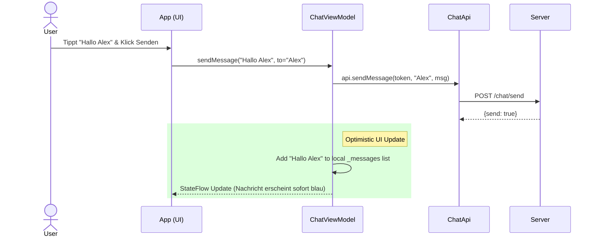
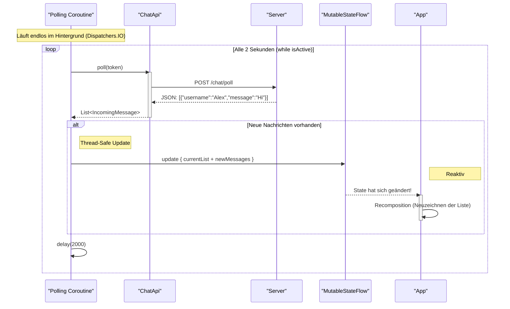
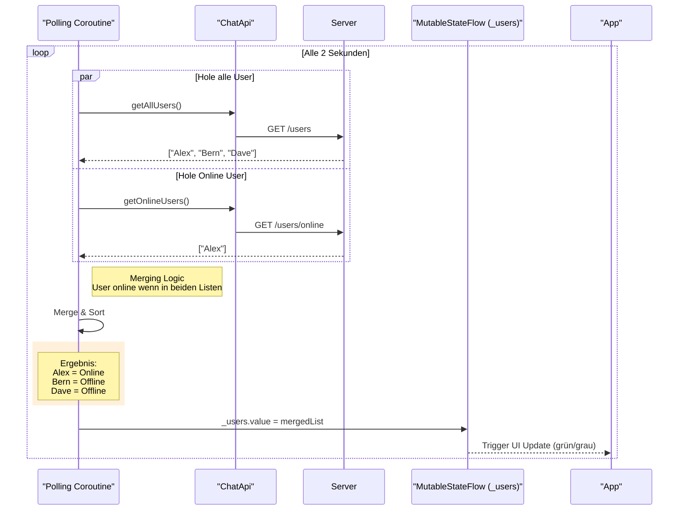

# **Kotlin Chat Client (Compose Desktop)**

Dieses Projekt ist eine Portierung eines bestehenden JavaFX Chat Clients auf **Kotlin Multiplatform (Compose Desktop)**. Es demonstriert moderne UI-Entwicklung, reaktive Architektur (MVVM) und asynchrone Netzwerkkommunikation mit Coroutines.

## Disclaimer
This project was Vibe Coded.

Dieses Projekt entstand durch iterative, KI-gestützte Entwicklung ("Vibe Coding"). Der Code wurde in Zusammenarbeit mit einem LLM erstellt, um moderne Best Practices von Kotlin Multiplatform und Compose effizient umzusetzen und Legacy-Konzepte sauber zu migrieren.

## **1\. Installation & Start**

### **Voraussetzungen**

* **IntelliJ IDEA** (Community oder Ultimate Edition).
* **JDK 21** (JDK25 wird nicht unterstützt).

### **Projekt starten**

1. Repository klonen/pullen:  
   `git pull origin main`

2. Projekt öffnen:  
   Öffnen Sie den Ordner KotlinChatClient in IntelliJ IDEA.
3. Gradle Sync:  
   Warten Sie, bis IntelliJ die Indizierung abgeschlossen und alle Abhängigkeiten heruntergeladen hat.
4. **Ausführen:**
    * Navigieren Sie zu: `composeApp/src/jvmMain/kotlin/local/dev/main.kt`.
    * Klicken Sie auf den grünen **Run-Pfeil** (▶) neben der main-Funktion.

## **2\. Projektstruktur & Dateierklärung**

Der Code befindet sich unter `composeApp/src/jvmMain/kotlin/local/dev/`.

| Datei | Rolle | Beschreibung                                                                                                                                                       |
| :---- | :---- |:-------------------------------------------------------------------------------------------------------------------------------------------------------------------|
| **main.kt** | **Entry Point** | Startet das native Desktop-Fenster (Window). Hier wird der Lifecycle verwaltet (z.B. Logout beim Schliessen der App).                                               |
| **App.kt** | **View (UI)** | Die grafische Oberfläche in **Compose**. Enthält LoginScreen und ChatScreen. Sie ist rein deklarativ und beobachtet nur den State aus dem ViewModel. Keine Logik\! |
| **ChatViewModel.kt** | **ViewModel** | Das "Gehirn" der App (MVVM). Es hält den State (users, messages) und führt die Logik aus (Login, Polling-Loop, Nachricht senden). Es kennt **keine** UI-Elemente.  |
| **ChatApi.kt** | **Model (Data)** | Die Netzwerkschicht. Nutzt **Ktor**, um HTTP-Requests (GET, POST) an den Server zu senden. Behandelt JSON-Parsing und Fehlercodes.                                 |
| **Models.kt** | **Model (DTOs)** | Alle Datenklassen. Hier unterscheiden wir zwischen *DTOs* (Data Transfer Objects für JSON) und *UI-Modellen* (für die Anzeige).                                    |

## **3\. Architektur: MVVM (Model \- View \- ViewModel)**

Wir nutzen MVVM, um Logik und Anzeige strikt zu trennen. Das erhöht die Testbarkeit und Stabilität.


* **Abstraktion:** Die App.kt weiss nicht, wie eine Nachricht gesendet wird (HTTP? Websocket?). Sie ruft nur viewModel.sendMessage() auf.
* **Unidirectional Data Flow:** Daten fließen nur in eine Richtung: **ViewModel \-\> State \-\> UI**. Die UI ändert niemals Daten direkt, sie löst nur Events aus.

## **4\. Deep Dive: JavaFX vs. Kotlin Compose**
Hier vergleichen wir den originalen JavaFX-Code (imperativ) mit dem neuen Compose-Code (deklarativ/reaktiv).

### **A. Threading & Polling (Der Hintergrund-Loop)**

**Das Problem:** Um die UI nicht einzufrieren, darf das Netzwerk-Polling nicht im Hauptthread laufen. Gleichzeitig darf man aus dem Hintergrund nicht auf die UI zugreifen.

#### **JavaFX (Alt: ExecutorService & Platform.runLater)**

Der JavaFX-Ansatz erfordert manuelles Thread-Management und explizites Umschalten auf den UI-Thread (`Platform.runLater`).

Aus `ChatController.java`:
```java
// 1. Setup des Thread-Pools
executorService = Executors.newScheduledThreadPool(2);

// 2. Task Scheduling (Polling alle 3 Sekunden)
messagePollingFuture = executorService.scheduleAtFixedRate(
    new MessagePollingTask(this.chatService, this),
    0, 3, TimeUnit.SECONDS
);

// ... im Task selbst oder im Callback:
// 3. Zurückwechseln auf den UI-Thread (Zwingend notwendig!)
Platform.runLater(() -> {
    if (success) {
        // UI Update hier...
    }
});
```
#### **Kotlin Compose (Neu: Coroutines)**
Wir nutzen `Kotlin Coroutines`. Der Code liest sich linear ("wie eine Endlosschleife"), ist aber asynchron und blockiert nicht. Das Thread-Hopping passiert automatisch.

```kotlin
// 1. Starten im ViewModel-Scope (Automatisches Aufräumen beim Beenden)
pollingJob = viewModelScope.launch {
    
    // 2. Einfache While-Schleife statt ScheduledExecutor
    while (isActive) {
        try {
            // 'suspend' Funktion: Wartet hier auf Netzwerk, blockiert aber KEINE Threads
            val newMessages = api!!.poll(myToken)

            // 3. State Update: Direkt hier möglich! 
            // Compose erkennt die Änderung und updated die UI im nächsten Frame sicher.
            _messages.update { current -> current + convertedMessages }
            
        } catch (e: Exception) { ... }

        // 4. Wartezeit (suspend)
        delay(2000) 
    }
}
```

### **B. Data Binding & UI Updates (Listen)**

**Das Problem:** Wie kommen die Daten aus dem Hintergrund in die Anzeige?

#### **JavaFX (Alt: ObservableList & Mutation)**
In JavaFX müssen wir eine spezielle Liste (ObservableList) erstellen und diese imperativ verändern (leeren, befüllen).

Aus `ChatController.java`:
```java
// Init
userListObservable = FXCollections.observableArrayList();
userListView.setItems(userListObservable);

// Update Logik (Muss manuell getriggert werden)
private void updateUserListGUI() {
    List<User> users = chatService.getUserStatusList();
    
    // "Lösche alles und füge neu hinzu" (Imperativ)
    userListObservable.clear();
    userListObservable.addAll(users);
}
```
#### **Kotlin Compose (Neu: StateFlow & Recomposition)**

In Compose definieren wir einen Datenstrom (`StateFlow`). Die UI ist eine Funktion dieses Zustands. Wir ändern nie die UI direkt, sondern nur die Daten.

Aus `ChatViewModel.kt` (Logik):
```kotlin
// Definition des Zustands (Thread-Safe)
private val _users = MutableStateFlow<List<UserUiItem>>(emptyList())
val users = _users.asStateFlow()

// Update (einfache Zuweisung)
_users.value = sortedList
```
Aus `App.kt` (UI):
```kotlin
@Composable
fun App(viewModel: ChatViewModel) {
    // 1. Abonnieren: Jede Änderung an 'users' triggert ein Neuzeichnen
    val users by viewModel.users.collectAsState()

    // 2. Deklarativ: "Zeige eine Liste basierend auf dem aktuellen Stand"
    LazyColumn {
        items(users) { user ->
            UserRow(name = user.username, ...)
        }
    }
}
```


## **5\. Warum @Serializable?**

In Models.kt sieht man zwei Arten von Klassen:

### **1\. Mit @Serializable**
```kotlin 
@Serializable  
data class LoginRequest(...)
```
* **Zweck:** Diese Objekte verlassen die App. Sie müssen in **Text (JSON)** umgewandelt werden, um über das Netzwerk an den Server geschickt zu werden (Serialization), oder vom Server kommend wieder in Objekte verwandelt werden (Deserialization).
* **Library:** kotlinx.serialization übernimmt diese komplexe Umwandlung.

### **2\. Ohne @Serializable**
```kotlin 
data class UiChatMessage(...)
```
* **Zweck:** Diese Objekte existieren **nur im Arbeitsspeicher (RAM)** der App.
* Wir nutzen sie, um Daten für die Anzeige aufzubereiten (z.B. fügen wir ein isFromMe-Flag hinzu oder wandeln Datumsformate um).
* Da sie nie über das Netzwerk gesendet werden, brauchen sie keinen JSON-Konverter.

## Login Ablauf
Der User loggt sich ein, wir holen das Token und starten den Polling-Loop.


## Nachricht senden
Wichtig: Wir nutzen "Optimistic UI". Wir fügen die eigene Nachricht sofort lokal hinzu (Blau).


## Nachricht empfangen



## User-Liste & Online-Status (Polling) 
Parallel zu den Nachrichten wird auch die User-Liste aktualisiert. Hier wird die Logik für den grünen Punkt berechnet.
